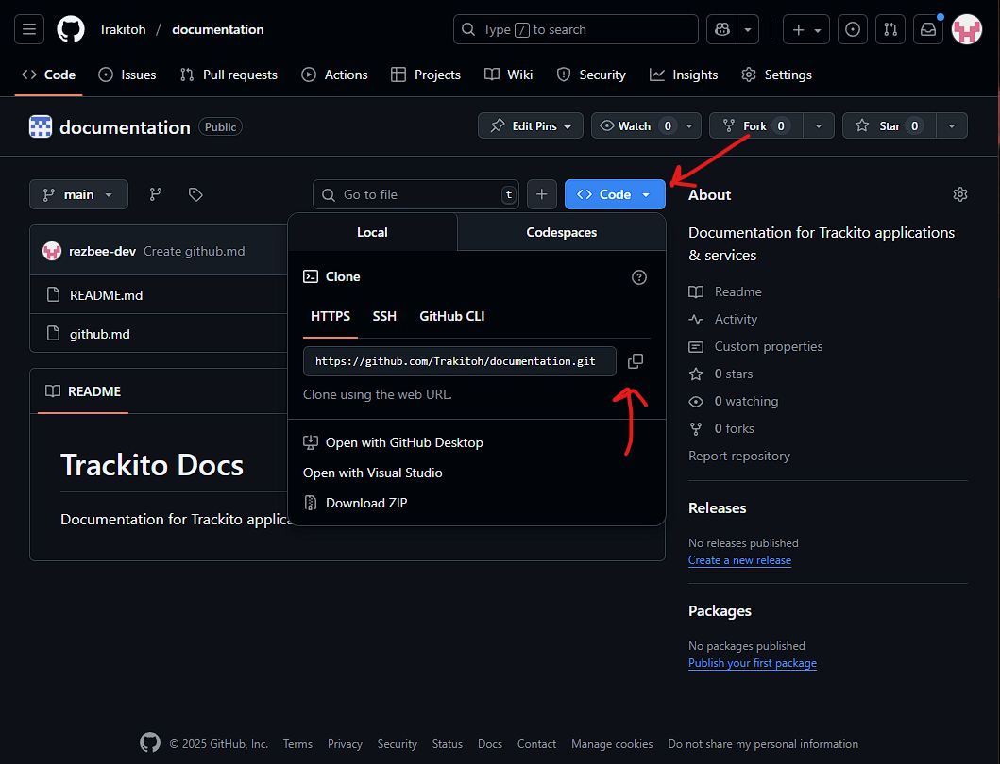
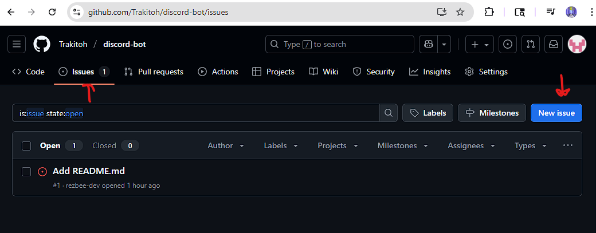
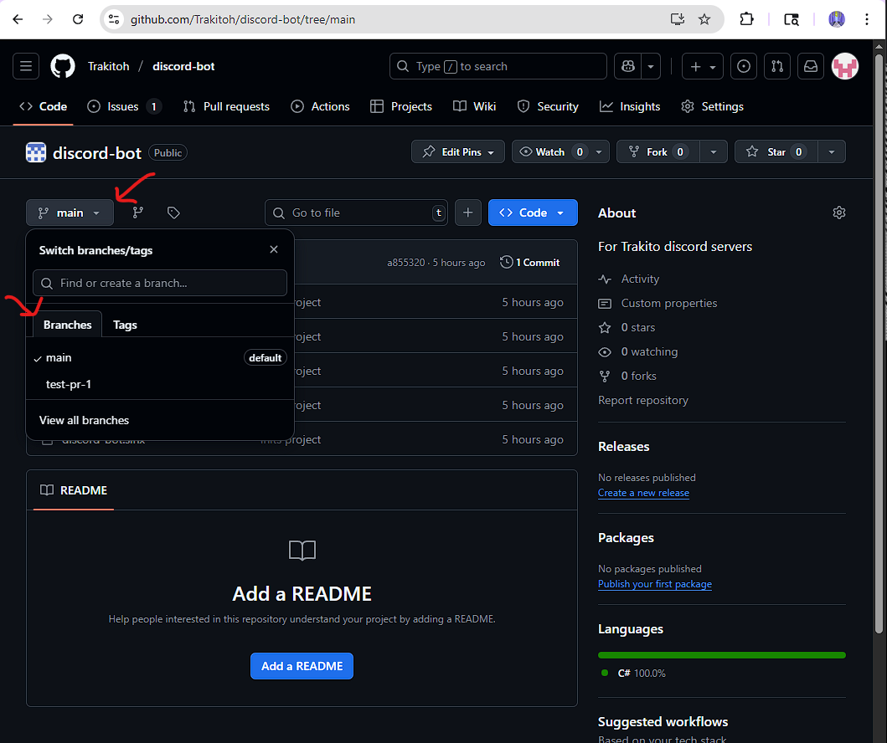
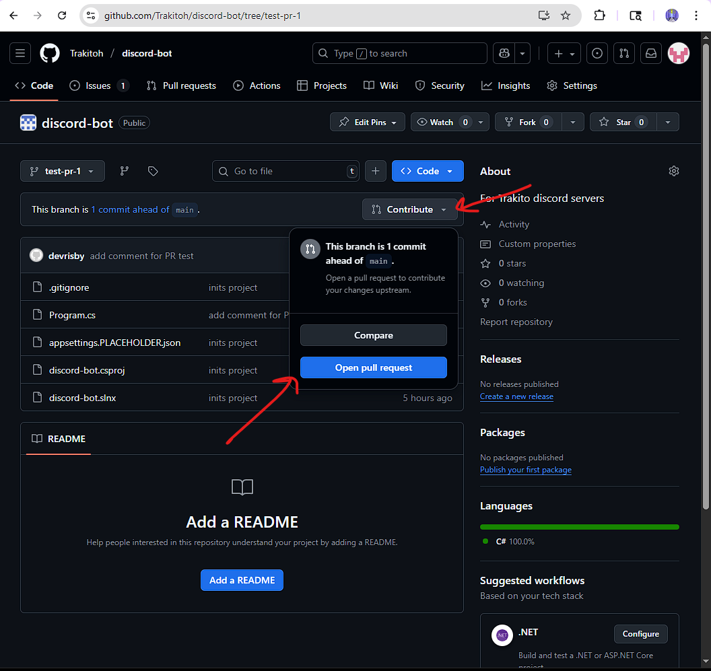
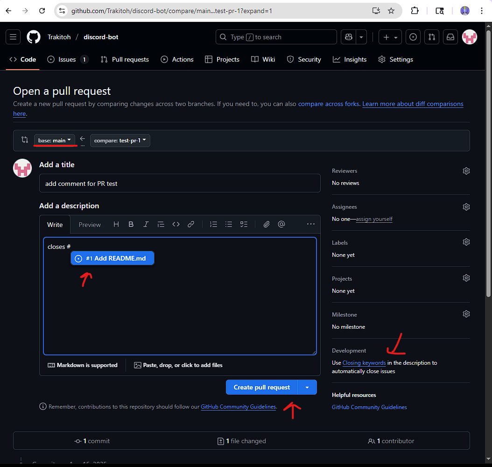
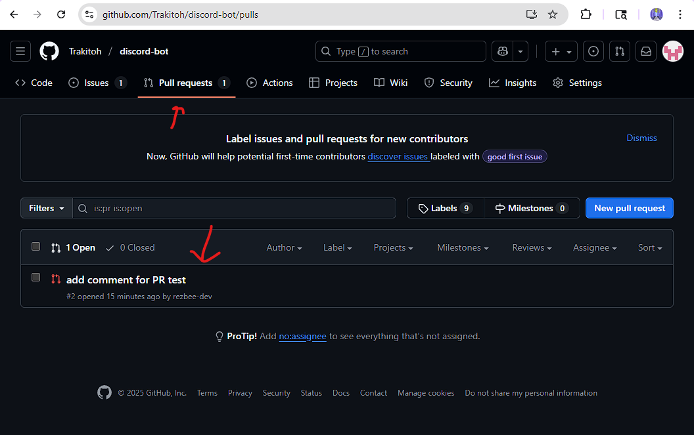
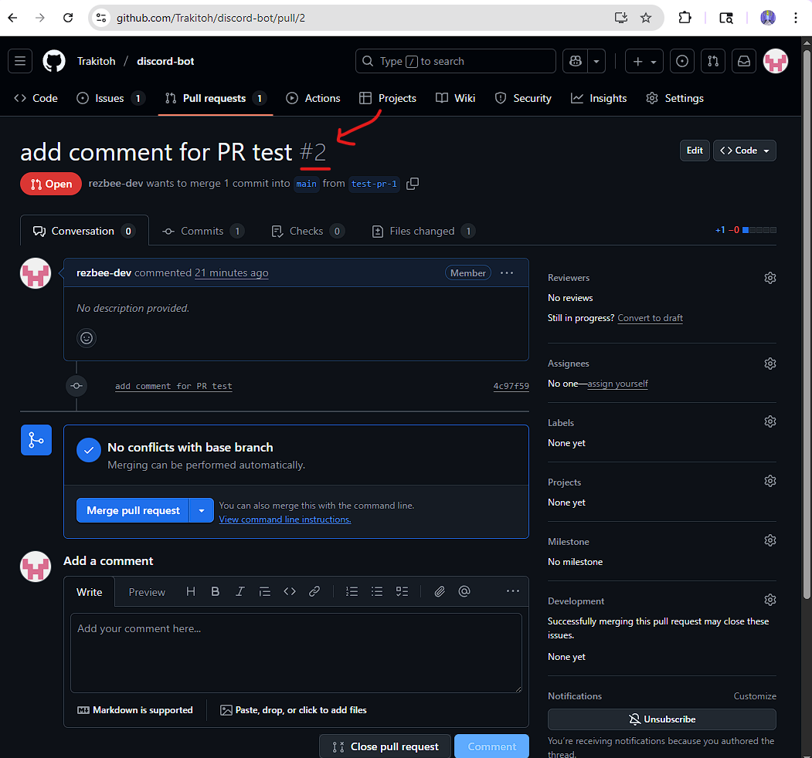

# Github Workflow

_NOTE: The suggestions made in this document are just one particular way of doing things in Github out of many_

_NOTE: any `<>` brackets in code snippets indicates you need to replace it with whatever specific thing that goes there; `<>` should not be included in your code or terminal command_

_NOTE: info for forked repos to be included later_

<br>

## Table of Contents
- [A. Cloning project](#a-cloning-project)
- [B. Working on Project](#b-working-on-project)
- [C. Reviewing Pull Requests](#c-reviewing-pull-requests)

<br>

## A. Cloning project

<details>
<summary>1. Copy project URL.</summary>


</details>

2. Navigate to your directory where you wish to save your project.

3. Open up your terminal and enter in `git clone <project URL>`

4. You should be able to see the project files insde the newly created directory

5. In your terminal, navigate to the newly created directory and enter in `git status` to confirm project was correctly cloned

<br>

## B. Working on Project

_NOTE: all significant code contributions or changes must be associated with a git issue or project board item_

### No Existing Issues or Project Items
1. Go to project repo on GitHub.com

<details>
<summary>2. Click on "Issues", then "New Issue"</summary>


</details>

3. Create your feature suggestion, bug fix, etc. 

4. Allow some time for project maintainers to review your issue before you start work

### Existing Issues or Project Items
1. Navigate to the project directory on your computer.
2. Open up the terminal.
3. Enter in `git pull origin <main branch name>` (syncs your project to repo project)
4. Enter in `git checkout -b <issue #>-<issue-short-title>` (creates and switches to new branch)
5. Add your code additions and modifications
6. Commit your changes
    ```
        # Stage a specific file
        git add <file_name>

        # Stage all changes in the current directory
        git add .

        # Please keep to 50 characters in length! 
        # If need more space, then use the commit body
        git commit -m "Your descriptive commit message here"
    ```
7. Push changes to remote branch, `git push -u origin <your-branch-name>`
8. Go to Project GitHub Page
<details>
<summary>9. Switch to the branch you just pushed</summary>


</details>
<details>
<summary>10. Open pull request</summary>


</details>
<details>
<summary>11. Create pull request to the active branch & link it to the git issue</summary>


</details>
12. Wait for review & feedback

<br>

## C. Reviewing Pull Requests
<details>
<summary>1. Navigate to project repo on GitHub, go to "Pull Requests", and select a PR for review</summary>


</details>

<details>
<summary>2. Take note of the ID number of the PR</summary>


</details>

3. Navigate to the project on your computer
4. Open terminal and enter, `git fetch origin pull/<ID#>/head:<whatever-branch-name>`
5. Switch to the newly created branch & now you can review the code
6. _Note: you may also create changes and push them to the existing PR_